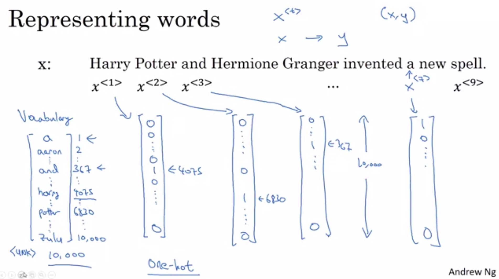
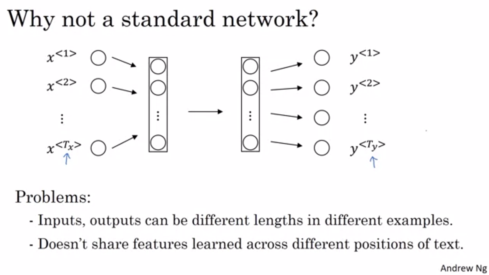
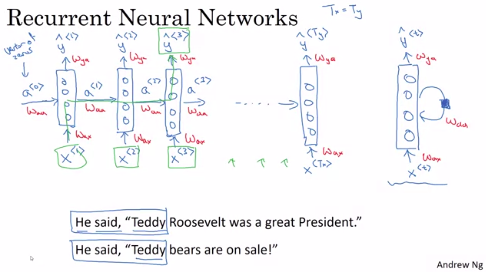
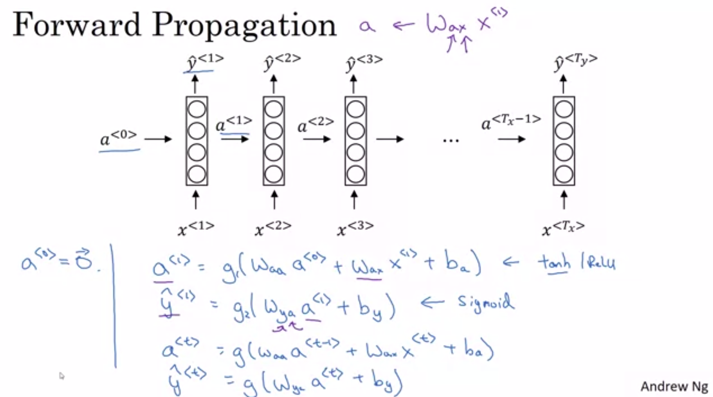
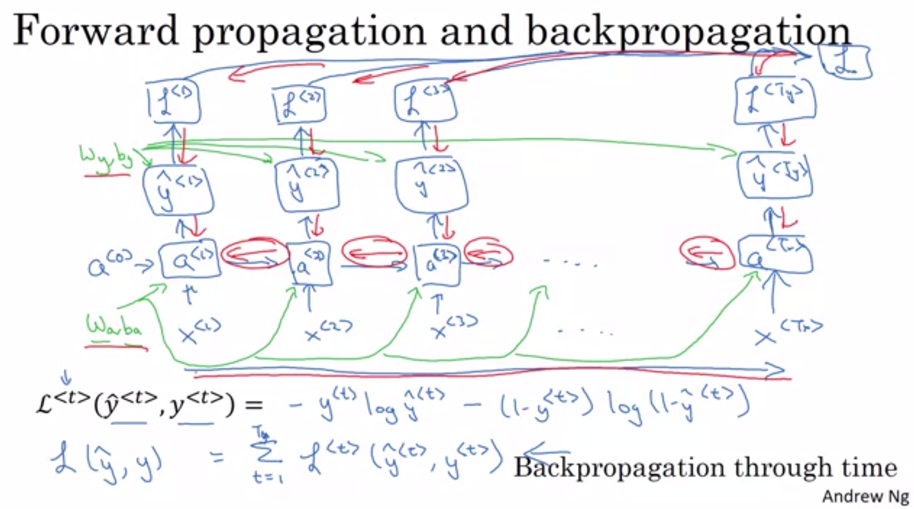
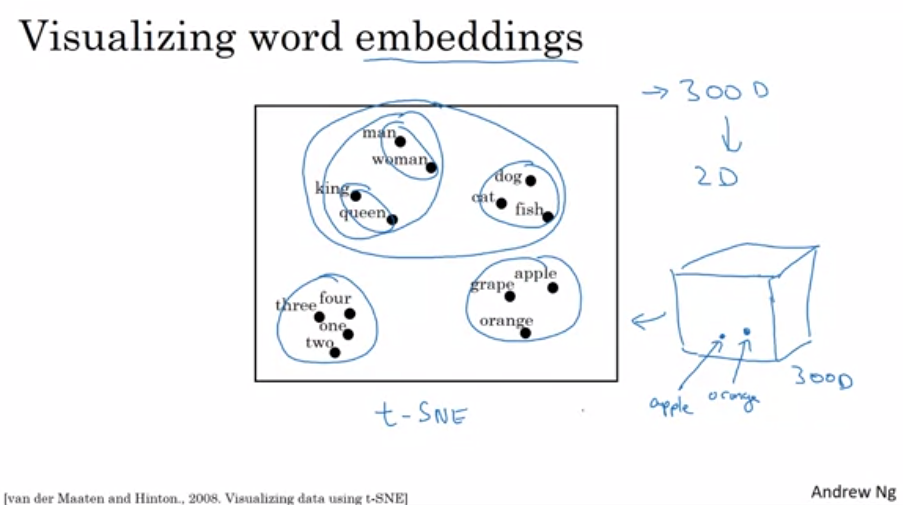
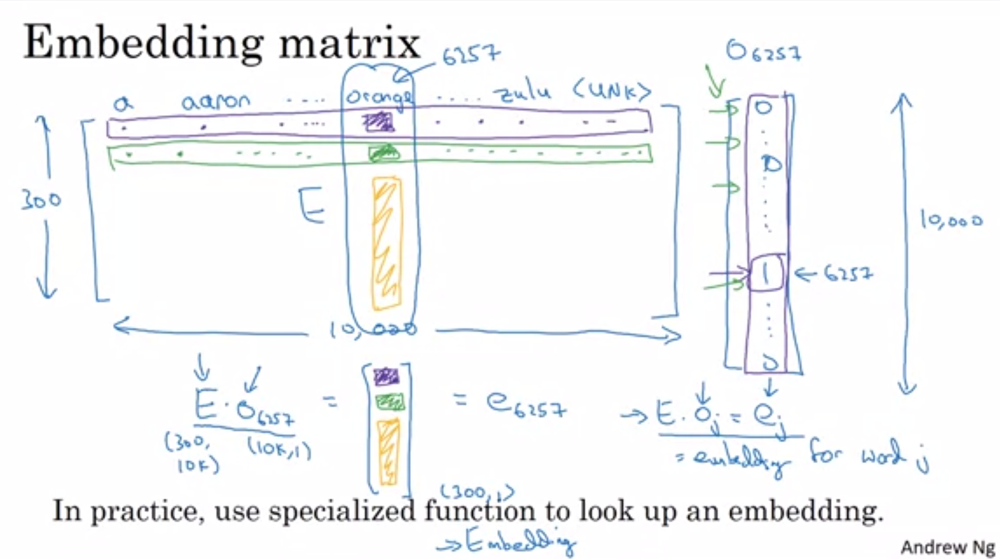

## Sequence Models

If x1 is `John` and x6 is also `John`, the network does not benefit from it.

### Recurrent Neural Networks

When making the prediction for y3, it gets the information not only from x3 but also the information from x1 and x2 because the information on x1 can pass through this way to help to prediction with y3. Now, one weakness of this RNN is that it only uses the information that is earlier in the sequence to make a prediction. In particular, when predicting y3, it doesn't use information about the worst x4, x5, x6 and so on. So this is a problem because if you are given a sentence, *"He said Teddy Roosevelt was a great president"*, in order to decide whether or not the word `Teddy` is part of a person's name, it would be really useful to know not just information from the first two words but to know information from the later words in the sentence as well because the sentence could also have been, *"He said teddy bears they're on sale."* So given just the first three words it is not possible to know for sure whether the word `Teddy` is part of a person's name. In the first example, it is. In the second example, it is not. But you can't tell the difference if you look only at the first three words. So one limitation of this particular neural network structure is that the prediction at a certain time uses inputs or uses information from the inputs earlier in the sequence but not information later in the sequence.

**Note on Notation**: In Wax the second (x) means that this Wax is going to be multiplied by some X-like quantity, and the (a) means that this is used to compute some a-like quantity. Similarly, Wya is multiplied by some a-like quantity to compute a y-type quantity. 

**Forward Propagation**: You would start off with a0 is the vector of all zeros, and then using a0 and x1, you will compute a1 and y-hat1, and then you take x2 and use x2 and a1 to compute a2 and y-hat2, and so on, and you'd carry out forward propagation going from the left to the right of this picture.

### Word Embeddings

One of the weaknesses of this representation is that it treats each word as a thing unto itself, and it doesn't allow an algorithm to easily generalize the cross words. For example, let's say you have a language model that has learned that when you see *I want a glass of orange ____.* Well, what do you think the next word will be? Very likely, it'll be "juice". But even if the learning algorithm has learned that *I want a glass of orange juice* is a likely sentence, if it sees *I want a glass of apple ____.* As far as it knows the relationship between "apple" and "orange" is not any closer as the relationship between any of the other words "man", "woman", "king", "queen", and "orange". And so, it's not easy for the learning algorithm to generalize from knowing that "orange juice" is a popular thing, to recognizing that "apple juice" might also be a popular thing or a popular phrase. And this is because the any product between any two different one-hot vector is zero. If you take any two vectors say, "queen" and "king" and any product of them, the end product is zero. If you take "apple" and "orange" and any product of them, the end product is zero. And you couldn't distance between any pair of these vectors is also the same. So it just doesn't know that somehow "apple" and "orange" are much more similar than "king" and "orange" or "queen" and "orange".

**Words Embeddings**: learn high dimensional feature vectors like these, that gives a better representation than one-hot vectors for representing different words.  
And the features we'll end up learning won't be easy to interpret like that component one is gender, component two is royal, component three is age and so on. Exactly what they're representing will be a bit harder to figure out. But nonetheless, the featurized representations we will learn, will allow an algorithm to quickly figure out that "apple and orange" are more similar than say, "king and orange" or "queen and orange".

The reason we call them embeddings is, you can think of a 300 dimensional space. And what you do is you take every words like "orange", and have a 300 dimensional feature vector so that word "orange" gets embedded to a point in this 300 dimensional space. And the word "apple" gets embedded to a different point in this 300 dimensional space. And of course to visualize it, algorithms like t-SNE, map this to a much lower dimensional space, you can actually plot the 2D data and look at it. But that's what the term embedding comes from.

For building a Neural language Model, it’s more common to use last 4 words as context.  
But for finding out word embeddings, any of the other contexts can be used as well.

