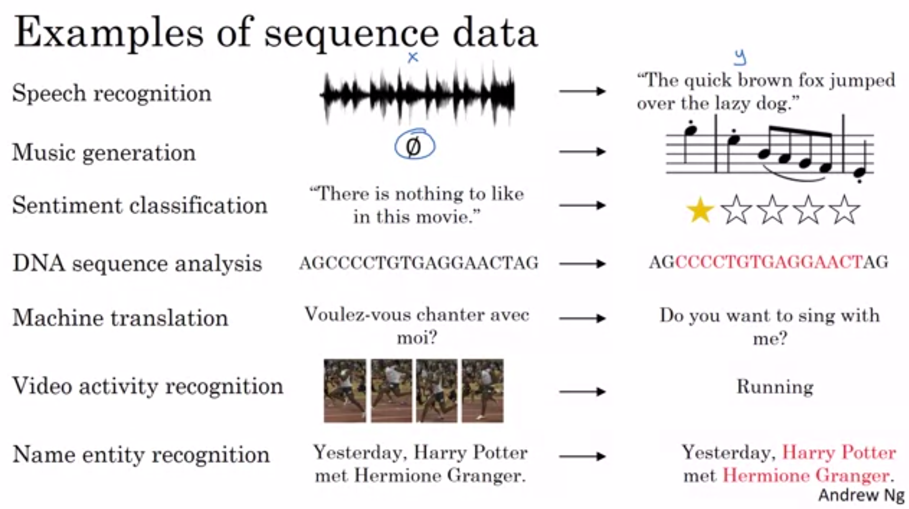
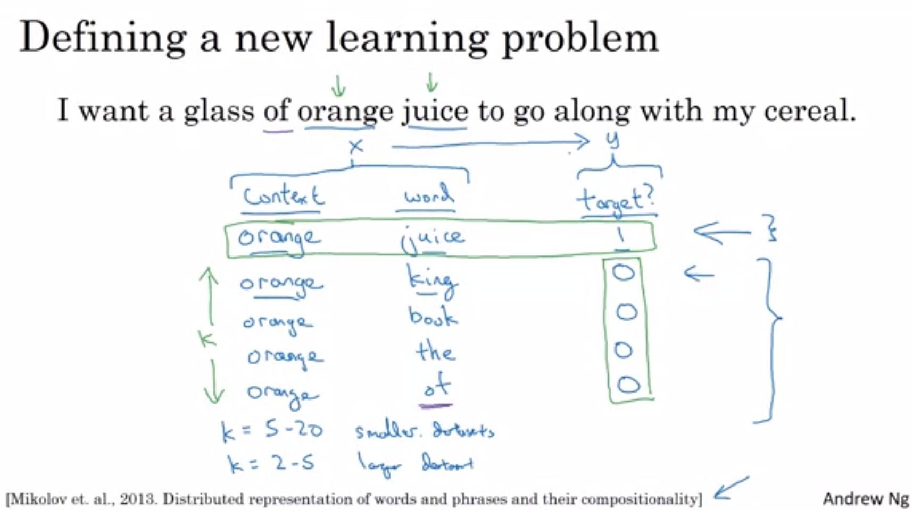
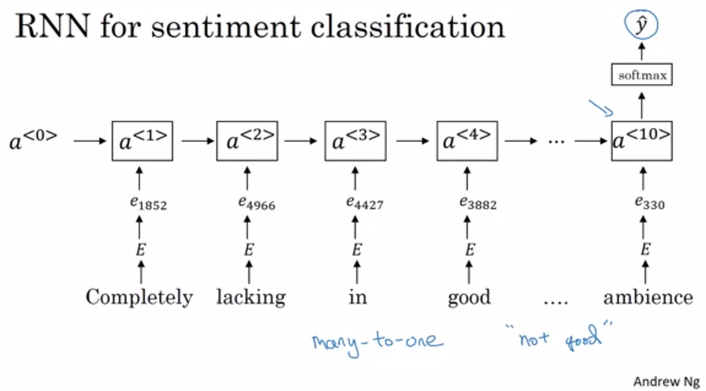

## Sequence Models

If x1 is `John` and x6 is also `John`, the network does not benefit from it.

### Recurrent Neural Networks

When making the prediction for y3, it gets the information not only from x3 but also the information from x1 and x2 because the information on x1 can pass through this way to help to prediction with y3. Now, one weakness of this RNN is that it only uses the information that is earlier in the sequence to make a prediction. In particular, when predicting y3, it doesn't use information about the worst x4, x5, x6 and so on. So this is a problem because if you are given a sentence, *He said, "Teddy Roosevelt was a great president."*, in order to decide whether or not the word `Teddy` is part of a person's name, it would be really useful to know not just information from the first two words but to know information from the later words in the sentence as well because the sentence could also have been, *He said, "Teddy bears are on sale!"* So given just the first three words it is not possible to know for sure whether the word `Teddy` is part of a person's name. In the first example, it is. In the second example, it is not. But you can't tell the difference if you look only at the first three words. So one limitation of this particular neural network structure is that the prediction at a certain time uses inputs or uses information from the inputs earlier in the sequence but not information later in the sequence.

**Note on Notation**: In Wax the second (x) means that this Wax is going to be multiplied by some X-like quantity, and the (a) means that this is used to compute some a-like quantity. Similarly, Wya is multiplied by some a-like quantity to compute a y-type quantity. 

**Forward Propagation**: You would start off with a0 is the vector of all zeros, and then using a0 and x1, you will compute a1 and y-hat1, and then you take x2 and use x2 and a1 to compute a2 and y-hat2, and so on, and you'd carry out forward propagation going from the left to the right of this picture.

#### Different Types of RNNs

[3]

[4]

[5]

#### Language Model

[6]

What a language model does is given any sentence, its job is to tell you what is the probability of a sentence.

[7]

[8]

[9]

Using a character level language model has some pros and cons. One is that you don't ever have to worry about unknown word tokens. In particular, a character level language model is able to assign a sequence like mau, a non-zero probability. Whereas if mau was not in your vocabulary for the word level language model, you just have to assign it the unknown word token. But the main disadvantage of the character level language model is that you end up with much longer sequences. So many english sentences will have 10 to 20 words but may have many, many dozens of characters. And so character language models are not as good as word level language models at capturing long range dependencies between how the the earlier parts of the sentence also affect the later part of the sentence. And character level models are also just more computationally expensive to train.

[10]

GRU is one of the ideas in RNN that has enabled them to become much better at capturing very long range dependencies has made RNN much more effective.

[11]

the advantage of the GRU is that it's a simpler model and so it is actually easier to build a much bigger network, it only has two gates, so computationally, it runs a bit faster. So, it scales the building somewhat bigger models but the LSTM is more powerful and more effective since it has three gates instead of two. If you want to pick one to use, I think LSTM has been the historically more proven choice.

[12]

for a lots of NLP problems, for a lot of text with natural language processing problems, a bidirectional RNN with a LSTM appears to be commonly used. So, we have NLP problem and you have the complete sentence, you try to label things in the sentence, a bidirectional RNN with LSTM blocks both forward and backward would be a pretty views of first thing to try. So, that's it for the bidirectional RNN and this is a modification they can make to the basic RNN architecture or the GRU or the LSTM, and by making this change you can have a model that uses RNN and or GRU or LSTM and is able to make predictions anywhere even in the middle of a sequence by taking into account information potentially from the entire sequence. The disadvantage of the bidirectional RNN is that you do need the entire sequence of data before you can make predictions anywhere. So, for example, if you're building a speech recognition system, then the BRNN will let you take into account the entire speech utterance but if you use this straightforward implementation, you need to wait for the person to stop talking to get the entire utterance before you can actually process it and make a speech recognition prediction. So for a real type speech recognition applications, they're somewhat more complex modules as well rather than just using the standard bidirectional RNN as you've seen here. But for a lot of natural language processing applications where you can get the entire sentence all the same time, the standard BRNN algorithm is actually very effective. So, that's it for BRNNs and next and final video for this week, let's talk about how to take all of these ideas RNNs, LSTMs and GRUs and the bidirectional versions and construct deep versions of them.

[13]

### Word Embeddings

One of the weaknesses of this representation is that it treats each word as a thing unto itself, and it doesn't allow an algorithm to easily generalize the cross words. For example, let's say you have a language model that has learned that when you see *I want a glass of orange ____.* Well, what do you think the next word will be? Very likely, it'll be "juice". But even if the learning algorithm has learned that *I want a glass of orange juice* is a likely sentence, if it sees *I want a glass of apple ____.* As far as it knows the relationship between "apple" and "orange" is not any closer as the relationship between any of the other words "man", "woman", "king", "queen", and "orange". And so, it's not easy for the learning algorithm to generalize from knowing that "orange juice" is a popular thing, to recognizing that "apple juice" might also be a popular thing or a popular phrase. And this is because the any product between any two different one-hot vector is zero. If you take any two vectors say, "queen" and "king" and any product of them, the end product is zero. If you take "apple" and "orange" and any product of them, the end product is zero. And you couldn't distance between any pair of these vectors is also the same. So it just doesn't know that somehow "apple" and "orange" are much more similar than "king" and "orange" or "queen" and "orange".

**Words Embeddings**: learn high dimensional feature vectors like these, that gives a better representation than one-hot vectors for representing different words.  
And the features we'll end up learning won't be easy to interpret like that component one is gender, component two is royal, component three is age and so on. Exactly what they're representing will be a bit harder to figure out. But nonetheless, the featurized representations we will learn, will allow an algorithm to quickly figure out that "apple and orange" are more similar than say, "king and orange" or "queen and orange".

The reason we call them embeddings is, you can think of a 300 dimensional space. And what you do is you take every words like "orange", and have a 300 dimensional feature vector so that word "orange" gets embedded to a point in this 300 dimensional space. And the word "apple" gets embedded to a different point in this 300 dimensional space. And of course to visualize it, algorithms like t-SNE, map this to a much lower dimensional space, you can actually plot the 2D data and look at it. But that's what the term embedding comes from.

For building a Neural language Model, it’s more common to use last 4 words as context.  
But for finding out word embeddings, any of the other contexts can be used as well.

[1]

[2]

### Sequence Models and Attention Mechanism

[23]

this model works, given enough pairs of French and English sentences. If you train the model to input a French sentence and output the corresponding English translation, this will actually work decently well. And this model simply uses an encoder network, whose job it is to find an encoding of the input French sentence and then use a decoder network to then generate the corresponding English translation.

[24]

So how do you train a new network to input an image and output a caption like that phrase up there? Here's what you can do. From the earlier course on [inaudible] you've seen how you can input an image into a convolutional network, maybe a pre-trained AlexNet, and have that learn an encoding or learn a set of features of the input image. So, this is actually the AlexNet architecture and if we get rid of this final Softmax unit, the pre-trained AlexNet can give you a 4096-dimensional feature vector of which to represent this picture of a cat. And so this pre-trained network can be the encoder network for the image and you now have a 4096-dimensional vector that represents the image. You can then take this and feed it to an RNN, whose job it is to generate the caption one word at a time. 

[25]

So, to summarize, in this video, you saw how machine translation can be posed as a conditional language modeling problem. But one major difference between this and the earlier language modeling problems is rather than wanting to generate a sentence at random, you may want to try to find the most likely English sentence, most likely English translation. But the set of all English sentences of a certain length is too large to exhaustively enumerate. So, we have to resort to a search algorithm.

[26]

[27]

[28]

[29]

[30]

avoid numerical underflow, reduces the penalty for outputting longer translations.

[31]

[32]

[33]

